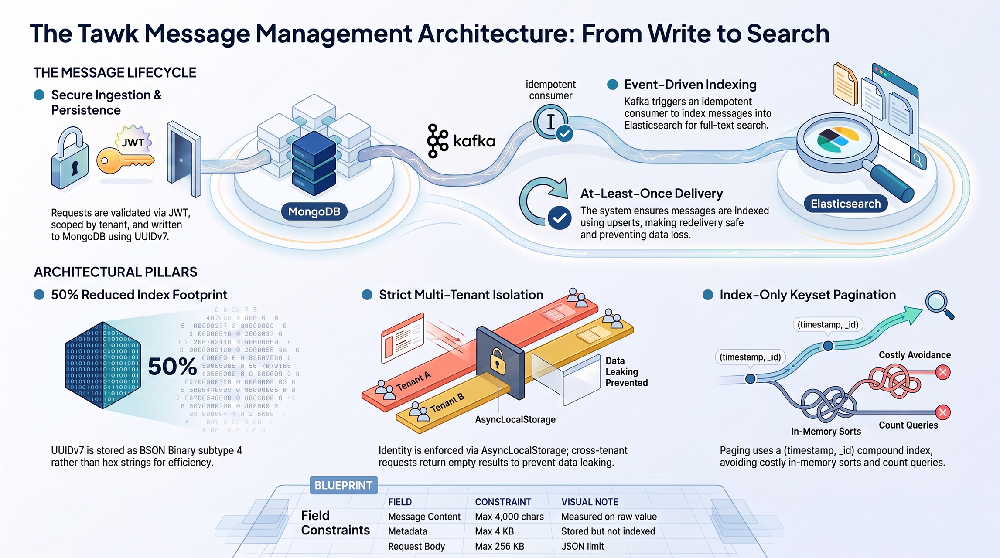

# tawk-message-management



## What it is

A multi-tenant message-management service, built as a senior engineer code
test: create a message, list a conversation's messages with keyset pagination,
and full-text search a conversation's messages. Messages are written to
MongoDB (the system of record), a message-created event is published to Kafka,
and a consumer indexes the message into Elasticsearch (a derived, rebuildable
read model). The domain vocabulary, API contract and non-functional
requirements this repo implements are the source of truth in
[`CONTEXT.md`](CONTEXT.md); every architectural decision below is backed by an
ADR in [`docs/adr/`](docs/adr/index.md).

> 📐 [Architectural Decisions Record](https://message-management.pages.dev/adr/) — 20 records detailing stack choices, architectural tradeoffs, and design decisions.

> 📄 [Project Specification](https://message-management.pages.dev/spec/) — interactive design document covering system architecture, data models, API design, and testing strategy.

## Setup

**`nub` only — never `npm`, `pnpm`, `yarn`, `npx`, or `bun`.**

```bash
# 1. Start Mongo, Kafka and Elasticsearch
docker compose up -d

# 2. Install dependencies
nub install

# 3. Copy the env template BEFORE generating keys
cp .env.example .env

# 4. Generate an ES256 keypair; the public half is appended to .env,
#    the private half is printed to stdout for minting test tokens
nub run auth:keygen

# 5. Start the API
nub run start
```

Order matters in steps 3–4: `scripts/keygen.ts` *appends*
`JWT_PUBLIC_KEY=...` to `.env` with `appendFileSync`. If `.env` doesn't exist
yet, the append has nothing to append to and the key is lost when something
later creates `.env` from the template; if `.env.example` is copied over `.env`
*after* keygen runs, the empty placeholder overwrites the real key. Copying
`.env.example` to `.env` first means keygen's line lands after the empty
`JWT_PUBLIC_KEY=` placeholder already in the file — two `JWT_PUBLIC_KEY` lines,
which is harmless: this project reads `.env` with last-value-wins semantics, so
the real key (added second) is the one that takes effect. Verified from a clean
checkout as part of this task — see the note on `express` below for the one
setup problem that verification actually found.

Once running:

```bash
curl localhost:3000/health
# {"status":"ok","indexer":"running"}
```

`/health` reports `503` if the Elasticsearch indexing consumer has crashed —
see [Trade-offs](#trade-offs-and-what-is-deliberately-absent).

### A setup bug this task found and fixed

Following the setup section literally from a clean checkout (`nub install` →
`docker compose up -d` → `auth:keygen` → `nub run start`) crashed on
`nub run start` with `ERR_MODULE_NOT_FOUND: Cannot find package 'express'`.
`src/main.ts` imports `express` directly (to mount `express.json()` with a body
size limit), but only `@nestjs/platform-express` — not `express` itself — was a
declared dependency; `express` was reachable only as *its* undeclared
transitive dependency. `nub`'s isolated `node_modules` doesn't expose phantom
dependencies the way a hoisted, flat `node_modules` would, so this had never
surfaced under `nub run test` (Jest never imports `main.ts`'s bootstrap code)
and was invisible until the app was actually started. Fixed by declaring
`express` directly: `nub add express`.

Fixing that surfaced a second, pre-existing bug one layer down: `KafkaModule`,
`MongoModule` and `ElasticsearchModule` each declared their DI token
(`KAFKA_CLIENT`, `MESSAGES_COLLECTION`/`MONGO_CLIENT`, `ES_CLIENT`) as a
top-level `const`, then imported the class that `@Inject()`s that token
*after* the `const`, with a comment reasoning that circular `require()` caching
would make that ordering safe. That reasoning holds for CommonJS but not for
this project's ESM (`"type": "module"`) — ES module imports are hoisted ahead
of a module's own top-level statements regardless of where the `import`
appears lexically, so the token was still in its temporal dead zone when the
circularly-imported class read it, crashing with `ReferenceError: Cannot
access '...' before initialization`. This is why the app never actually booted
until this task ran it directly: the test suite bootstraps through Nest's
testing module with a different module resolution path that never hit it.
Fixed the same way in all three modules — moved each token into its own
file (`kafka-client.token.ts`, `mongo-client.token.ts`, `es-client.token.ts`)
that the module and its dependent class both import, removing the cycle
instead of relying on import order.

## Tests

```bash
nub run test        # everything
nub run test:unit    # domain + application, ports mocked — no infrastructure needed
nub run test:int     # endpoints via Nest's testing module — needs the compose stack
```

Unit tests never start Mongo, Kafka, or Elasticsearch; if a unit test needed
one, that would be a layering bug (see [DDD layering](#ddd-layering-and-the-eslint-boundary)),
not a reason to start a container. Integration tests wait for the
Elasticsearch refresh explicitly rather than asserting immediately after a
`POST` (see `test/wait-for.ts`).

## API contract

Every endpoint requires a valid JWT bearer token (`Authorization: Bearer
<token>`) except `/health`. `tenantId` and `senderId` are taken from the
token's verified `tid` and `sub` claims — **`senderId` is never accepted in a
request body, header, or query parameter.** Full request/response schemas,
generated from the DTOs, are served at `/api/docs`.

### `POST /api/messages`

```bash
curl -X POST localhost:3000/api/messages \
  -H "Authorization: Bearer $TOKEN" -H "Content-Type: application/json" \
  -d '{"conversationId":"conv-42","content":"hello there"}'
```

```json
{
  "id": "01991a3e-2f3f-7c9a-8b1a-3f6e2a9b7d10",
  "conversationId": "conv-42",
  "senderId": "sender-1",
  "content": "hello there",
  "timestamp": "2026-08-15T10:00:00.000Z"
}
```

### `GET /api/conversations/:conversationId/messages`

```bash
curl "localhost:3000/api/conversations/conv-42/messages?limit=20&sort=desc" \
  -H "Authorization: Bearer $TOKEN"
```

```json
{
  "items": [
    { "id": "...", "conversationId": "conv-42", "senderId": "sender-1",
      "content": "hello there", "timestamp": "2026-08-15T10:00:00.000Z" }
  ],
  "nextCursor": "MTc4Njc4OTk4NjA0Mjox..."
}
```

`nextCursor` is `null` on the last page. Pass it back as `?cursor=...` with the
same `sort` to fetch the next page.

### `GET /api/conversations/:conversationId/messages/search?q=term`

```bash
curl "localhost:3000/api/conversations/conv-42/messages/search?q=hello" \
  -H "Authorization: Bearer $TOKEN"
```

```json
{ "items": [ { "id": "...", "conversationId": "conv-42", "senderId": "sender-1",
    "content": "hello there", "timestamp": "2026-08-15T10:00:00.000Z" } ] }
```

## Architecture decisions

### DDD layering and the ESLint boundary

`domain` (entities, value objects, errors, ports) → `application` (use cases)
→ `infrastructure` (Mongo/Kafka/Elasticsearch adapters) → `interfaces`
(controllers, DTOs). Dependencies point inward; `domain` imports from none of
the other three layers. This is enforced by an ESLint
`import/no-restricted-paths` rule, not by convention — a layering violation is
a lint failure, not a code-review nit. See
[ADR-0005](docs/adr/0005-ddd-layering.md).

### The thin domain, and `MessageView` versus the entity

`Message` is deliberately the whole domain model: non-empty content, tenant
and conversation identity, an immutable timestamp, an id fixed at creation —
no `Conversation` aggregate (a conversation is identified by `conversationId`,
not stored), no invented value objects wrapping fields that have no invariant
to protect. See [ADR-0016](docs/adr/0016-thin-domain-model.md).

Read ports do not return `Message`. `MessageReader.listByConversation` returns
`Page<MessageView>` and `MessageSearcher.search` returns `MessageView[]` —
`MessageView` is a plain, behaviourless projection. `Message.create()`
generates identity and validates on construction, so reconstructing one from
persisted data would need a second, trust-the-input factory sitting next to
one whose entire job is not to trust its input. It also makes returning
Elasticsearch's `_source` directly honest: a search hit is a possibly-stale
projection of a derived index, not an entity, and `MessageView` doesn't claim
otherwise. See [ADR-0020](docs/adr/0020-read-model-separate-from-entity.md).

### UUIDv7 as `_id` in BSON Binary subtype 4

`_id` is a UUIDv7, generated in the domain layer, never a Mongo `ObjectId`.
v7's leading millisecond timestamp keeps inserts at the right edge of the
`_id` index instead of scattering them. It's stored as BSON `UUID` (Binary
subtype 4) rather than a hex string, halving the index footprint versus a
string id; the mapper is the one place `_id` ↔ the public `id` string
translation happens. See [ADR-0008](docs/adr/0008-uuid-primary-key.md).

### Keyset pagination

`GET .../messages` pages on `(timestamp, _id)`, never `skip` — `skip`'s cost
grows with offset, and it drops or repeats rows when writes land mid-page. The
repository asks for `limit + 1` rows (a lookahead row) and uses whether that
extra row exists to decide `nextCursor`, instead of a separate `count` query.
See [ADR-0013](docs/adr/0013-keyset-pagination.md).

The compound index is `{ tenantId: 1, conversationId: 1, timestamp: -1, _id:
-1 }`, named `tenant_conversation_timestamp_id`. `tenantId` leads because
every query filters by it; `conversationId` is next because every read and
write query also filters by it; `timestamp, _id` matches the sort and cursor
comparison so no in-memory sort is needed. `scripts/explain.ts` (`nub run
db:explain`) runs the actual list query — `find({ tenantId: 'tenant-a',
conversationId: 'demo' }).sort({ timestamp: -1, _id: -1 }).limit(21)` — through
`explain('queryPlanner')`. Captured output, against a seeded message:

```json
{
  "winningPlan": {
    "stage": "LIMIT",
    "limitAmount": 21,
    "inputStage": {
      "stage": "FETCH",
      "inputStage": {
        "stage": "IXSCAN",
        "keyPattern": { "tenantId": 1, "conversationId": 1, "timestamp": -1, "_id": -1 },
        "indexName": "tenant_conversation_timestamp_id",
        "direction": "forward",
        "indexBounds": {
          "tenantId": ["[\"tenant-a\", \"tenant-a\"]"],
          "conversationId": ["[\"demo\", \"demo\"]"],
          "timestamp": ["[MaxKey, MinKey]"],
          "_id": ["[MaxKey, MinKey]"]
        }
      }
    }
  },
  "rejectedPlans": []
}
```

The winning stage is `IXSCAN` on `tenant_conversation_timestamp_id` — the
query is answered entirely from the index, with no `rejectedPlans` and no
collection scan.

### Kafka topic, partition and consumer-group design

One topic (`message-created`, `KAFKA_TOPIC`), `KAFKA_PARTITIONS` partitions
(3 by default), one consumer group (`KAFKA_GROUP_ID`, `search-indexer`) whose
sole job is indexing into Elasticsearch. The producer key is
**`tenantId:conversationId`** — not `conversationId` alone, since two tenants
could otherwise coincidentally share a `conversationId` string and be forced
onto the same partition, and not `tenantId` alone, since that would serialize
every conversation for a busy tenant onto one partition. Keying on the pair
guarantees every message for one conversation lands on the same partition, so
per-conversation ordering holds, while still spreading unrelated conversations
— including different conversations for the same tenant — across partitions.
See [ADR-0010](docs/adr/0010-kafka-client-and-topology.md).

### At-least-once delivery with idempotent indexing

The producer is idempotent (`idempotent: true`, implying `acks: -1` and
`maxInFlight: 1`) with bounded retries so a broker outage fails fast rather
than stalling the write path — a publish failure is logged as `persisted but
not published`, never silently dropped. The consumer commits an offset only
after `eachMessage` resolves, so a crash mid-processing causes redelivery, not
loss. Redelivery is made safe by writing to Elasticsearch with
`id: event.id` — an upsert keyed on the message's own id, so indexing the same
event twice is a no-op rather than a duplicate. This combination is
**at-least-once delivery, idempotent indexing** — deliberately not
exactly-once, which Kafka cannot give you without a transactional outbox (see
[Trade-offs](#trade-offs-and-what-is-deliberately-absent)). See
[ADR-0011](docs/adr/0011-delivery-guarantees-idempotency.md).

### The explicit Elasticsearch mapping

`dynamic: 'strict'` with hand-declared fields, not Elasticsearch's default
dynamic mapping: `tenantId`, `conversationId`, `senderId` as `keyword`
(exact-match filters), `timestamp` as `date`, `content` as `text` with the
`standard` analyzer (the field actually searched). `metadata` is `{ type:
'object', enabled: false }` — stored in `_source` and returned, but not
indexed. `metadata` is client-controlled (`Record<string, any>` from the
create-message request), and dynamic mapping on client-controlled keys grows
the cluster's mapping state without bound as different callers send different
shapes; `enabled: false` keeps it available on read without ever becoming a
mapping or query concern. There's no `id` field in `_source` either: the
document id **is** the message id, so a copy in `_source` would be a second
value nothing keeps in sync. See [ADR-0009](docs/adr/0009-mongodb-system-of-record.md).

### Multi-tenancy: claims → ALS → repository filter

`tenantId` and `senderId` come only from the verified JWT's `tid` and `sub`
claims — never a header, query parameter, or request body field. An interceptor
puts the verified identity into `AsyncLocalStorage` right after the auth guard
runs, and every Mongo query and Elasticsearch query reads it from there rather
than from anything caller-supplied per call site. The repository throws if
identity is absent rather than falling back to an unscoped query — a missing
tenant context is an error, never a wildcard. A request for another tenant's
`conversationId` returns an **empty page, not a 404**: the repository always
filters by the caller's own `tenantId` *and* the requested `conversationId`
together, so a conversation belonging to a different tenant simply never
matches the filter — there's no code path that looks up "does this
conversation exist" independent of tenant, so there's nothing to 404 on, and
no signal is leaked about whether the id exists for someone else. See
[ADR-0012](docs/adr/0012-multi-tenancy.md).

### ES256 verification, algorithm pinned, no private key

Tokens are verified, not issued: the service holds `JWT_PUBLIC_KEY` only,
never a signing secret or private key, so it cannot mint a token even if
compromised — issuance belongs to an external identity provider that isn't
part of this system. The verifier pins `algorithms: ['ES256']` explicitly
rather than reading the algorithm from the token's own `alg` header; an
unpinned verifier lets an attacker re-sign a token under a different algorithm
and have the verifier follow along (algorithm confusion), and pinning is what
closes that off specifically for an *asymmetric* algorithm, where a symmetric
fallback would otherwise let someone forge a token using the public key as an
HMAC secret. No private key, dev or test included, is ever committed;
`nub run auth:keygen` generates one locally per checkout. See
[ADR-0018](docs/adr/0018-jwt-authentication.md).

## Trade-offs and what is deliberately absent

- **The write-then-publish gap.** `CreateMessage` persists to MongoDB, then
  publishes to Kafka; a crash between those two steps loses the event (and
  therefore the search-index update) while the message itself survives in
  Mongo, the system of record. Closing this fully needs a transactional
  outbox — write the message and an outbox record in the same Mongo
  transaction, then a separate relay publishes from the outbox — which is out
  of scope for this timebox. See [ADR-0011](docs/adr/0011-delivery-guarantees-idempotency.md).
- **No dead-letter queue.** A message that repeatedly fails to index has
  nowhere to go but redelivery. Instead, a crashed consumer marks itself
  stopped and `/health` returns `503` — the intent is a loud, visible failure
  (an operator sees a failing health check) over a silent one (search quietly
  stops updating while the API keeps returning `201`s), without building a DLQ
  and its own replay tooling.
- **API and indexer share a process.** `MessageCreatedConsumer` runs inside
  the same Nest application as the HTTP API, so the two cannot be scaled
  independently — a spike in search-indexing load competes with the HTTP
  server's resources, and a deployment can't add indexer capacity without also
  adding API capacity.
- **Search reads may be slightly stale.** `search()` returns the Elasticsearch
  `_source` as the response body, and Elasticsearch is a derived index kept
  current by the Kafka consumer, not by the request path — a message can be
  in Mongo and not yet searchable for the (usually sub-second) time it takes
  the event to be consumed and indexed.
- **No deep search pagination.** `search()` returns up to `limit` (max 100)
  results in one page with no `search_after` support — sufficient to
  demonstrate the search path, not a scalable pagination story for a search
  result set.
- **Three ranked deferrals**, none in scope, from
  [ADR-0017](docs/adr/0017-deferred-optional-scope.md), in the order they'd be
  picked up if time remained: **(1) stateful refresh tokens** — closes the
  irrevocability gap a stateless JWT leaves, and the ADR's preferred stretch
  goal; **(2) rate limiting**, keyed on tenant rather than client IP, which the
  ADR argues is the one non-obvious part of an otherwise ten-minute add;
  **(3) caching**, deferred last because keyset pagination and the compound
  index may already make the read path fast enough that caching would mask
  whether that indexing work was any good rather than add real value.
- **`@ApiProperty` is hand-written, not generated.** `@nestjs/swagger`'s CLI
  plugin infers decorators from TypeScript types via a `nest-cli.json`
  transform step, but this project runs `.ts` directly through `nub`
  ([ADR-0003](docs/adr/0003-nub-toolchain.md)) with no Nest CLI build step for
  the plugin to hook into, so every DTO property that appears in `/api/docs`
  carries an explicit `@ApiProperty()` / `@ApiPropertyOptional()`. See
  [ADR-0019](docs/adr/0019-api-documentation.md).

## Data-structure notes

- **The lookahead row, not a count query.** Deciding whether a "next page"
  exists by fetching `limit + 1` rows and checking whether the extra one
  showed up is one index-served query. A `COUNT` query to compute total pages
  would be a second query over the same filter, and under `skip`-free keyset
  pagination there's no stable "page number" for it to answer anyway.
- **Why the compound index key order is `tenantId, conversationId, timestamp,
  _id`.** Compound indexes are usable left-to-right: every query in this
  service equality-filters on both `tenantId` and `conversationId`, so both
  lead the key, with `tenantId` first because [ADR-0012](docs/adr/0012-multi-tenancy.md)
  treats it as the non-negotiable boundary every query carries. `timestamp,
  _id` follow in that order, matching the `.sort()` and the cursor's tie-break
  comparison exactly, so MongoDB can serve the sort directly from the index
  instead of pulling matching documents into memory to sort them — the
  `explain()` output above shows no in-memory `SORT` stage, only `IXSCAN` →
  `FETCH` → `LIMIT`.

## Developer tooling (optional)

Neither tool below is required to build, run, or test this project. They are
local developer aids — skip them entirely and everything still works.

### CodeGraph

Indexes the codebase into a queryable knowledge graph so AI coding agents can
locate and understand code without grepping through files.

- Install: https://github.com/colbymchenry/codegraph#get-started
- This repo is already initialised — `.codegraph/` exists, and its contents are
  gitignored (the database and daemon files are per-machine, not shared).
- Usage: `codegraph explore "<question or symbol names>"`,
  `codegraph node <symbol-or-file>`

### RTK

Filters and compresses CLI output, cutting the token cost of routine development
commands.

- Install: https://github.com/rtk-ai/rtk#installation
- Usage is transparent — commands are rewritten automatically via a Claude Code
  hook. `rtk gain` reports the savings; `rtk proxy <cmd>` runs a command
  unfiltered.
